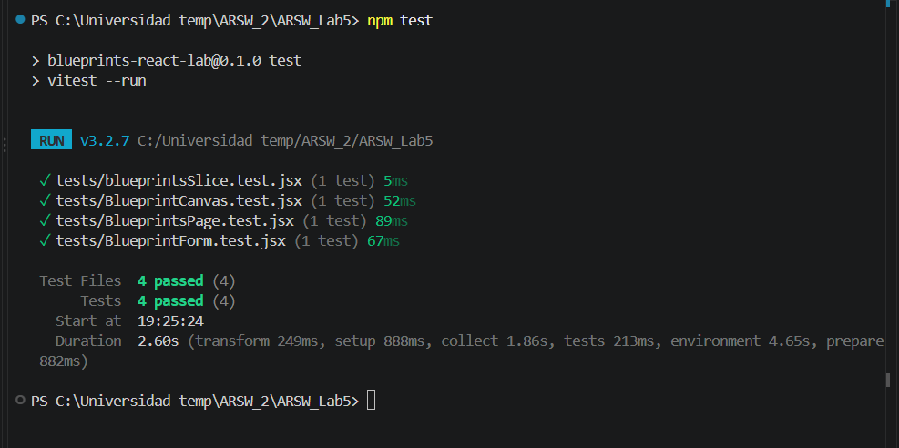
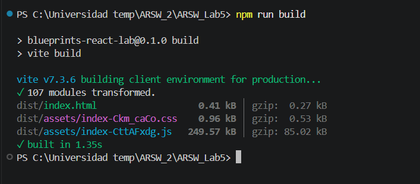
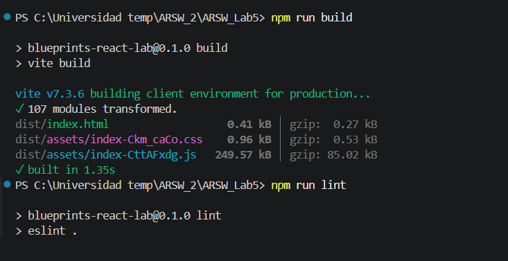

# Laboratorio Blueprints React

Autores: Tomas Quiceno y Deisy Guzmán

## Descripción

Este laboratorio consiste en modernizar el cliente web de Blueprints usando React, Vite, Redux Toolkit, Axios y pruebas con Vitest + Testing Library. El objetivo es consumir la API de blueprints, mostrar la información por autor, seleccionar un plano y dibujarlo en un canvas.

Se incluye además una capa de servicios que puede alternar entre un mock local y la API real mediante una variable de entorno.

> Referencia: [DEFINICIONES.md](./DEFINICIONES.md)

---

## Objetivos

- Diseñar una SPA con componentes reutilizables.
- Gestionar estado global con Redux.
- Consumir servicios REST con Axios.
- Implementar JWT en los interceptores del cliente.
- Dibujar blueprints en un canvas.
- Validar comportamiento con pruebas automatizadas.

---

## Requisitos previos

- Node.js 18+
- npm
- Backend de Blueprints levantado (si se quiere usar la API real)

---

## Instalación y ejecución

```bash
npm install
cp .env.example .env
npm run dev
```

La app queda disponible en:

```text
http://localhost:5173
```

---

## Variables de entorno

Archivo `.env`:

```env
VITE_API_BASE_URL=http://localhost:8080/api
VITE_USE_MOCK=true
```

- `VITE_USE_MOCK=true` usa el mock local.
- `VITE_USE_MOCK=false` usa la API real.

---

## Funcionalidades implementadas

- Búsqueda de blueprints por autor
- Tabla con nombre del blueprint, cantidad de puntos y botón Open
- Dibujo de puntos y segmentos en el canvas
- Estado global con Redux para blueprint actual
- Servicio mock y servicio real con la misma interfaz
- Formulario para crear blueprints
- JWT con interceptor HTTP
- Pruebas unitarias con Vitest

---

## Estructura del proyecto

```text
src/
  components/
  features/
  pages/
  services/
  store/
  App.jsx
  main.jsx
  styles.css

tests/
  BlueprintCanvas.test.jsx
  BlueprintForm.test.jsx
  BlueprintsPage.test.jsx
  blueprintsSlice.test.jsx
  setup.js
```

---

## Scripts disponibles

```bash
npm run dev
npm run build
npm run preview
npm run lint
npm test
```

---

## Resultado de validación

El proyecto quedó validado con ejecuciones reales sobre el código:

- `npm test` → pruebas pasando
- `npm run build` → compilación exitosa
- `npm run lint` → sin errores de lint

---

## Evidencias del laboratorio


### Evidencia 1: terminal - pruebas

- Captura de pantalla de `npm test`


### Evidencia 2: terminal - compilación

- Captura de pantalla de `npm run build`


### Evidencia 3: terminal - lint

- Captura de pantalla de `npm run lint`


### Evidencia 4: aplicación funcionando


- Captura de la interfaz en navegador
- Debe verse la tabla de blueprints, el canvas y el blueprint seleccionado

---

## Observación final

La solución quedó funcional y validada. Las capturas anteriores son la evidencia documental que debe entregarse junto con el repositorio para respaldar la entrega del laboratorio.
